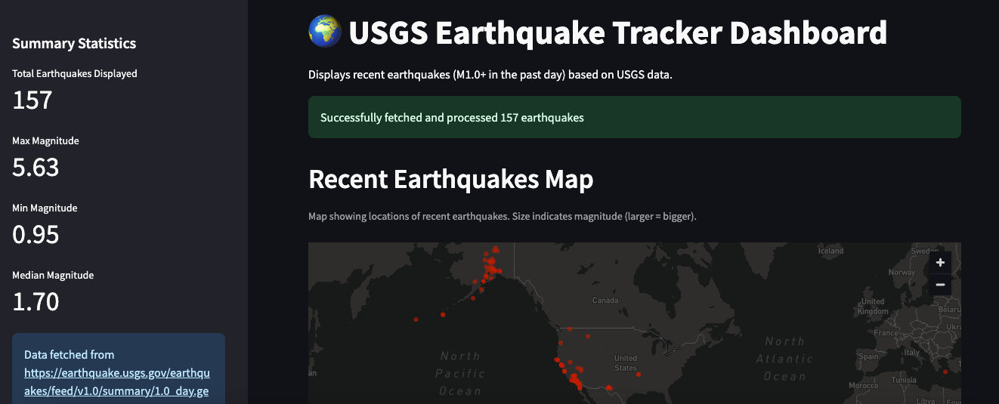

# 🌍 Earthquake Tracker Dashboard 🗺️

## Description

A simple informative web dashboard built with Streamlit that displays recent earthquake data fetched live from the U.S. Geological Survey (USGS). This project applies skills in API interaction, data processing with Pandas, and data visualization using Streamlit within a web application format. I did this as a portfolio project showcasing the ability to connect to external data sources, handle JSON data, and present information interactively. 😊

## Features ✨

*   ✅ **Live Data:** Fetches the latest earthquake data directly from the USGS feed.
*   ✅ **Interactive Map:** Displays earthquake locations visually on a map (`st.map`). Point size can indicate magnitude.
*   ✅ **Data Table:** Shows detailed earthquake information in a sortable table (`st.dataframe`).
*   ✅ **Summary Statistics:** Displays key metrics like total earthquakes fetched, max/min/median magnitude in a sidebar.
*   ✅ **Responsive Layout:** Uses Streamlit's layout options (`st.set_page_config(layout="wide")`, `st.sidebar`) for a clean presentation.

## Tech Stack 🛠️

*   **Language:** Python 🐍
*   **Libraries:**
    *   `streamlit`
    *   `requests` 
    *   `pandas` 
    *   `python-dotenv` 
    *   `sqlalchemy` 
*   **Data Source:** USGS Earthquake Hazards Program - Real-time Feeds (GeoJSON)

## Demo / Screenshot 📸




## Setup and Installation ⚙️

Follow these steps to run the dashboard locally:

1.  **Clone the repository:**
    ```bash
    git clone https://github.com/rameshmkumar/earthquake_dashboard.git
    cd earthquake-dashboard
    ```

2.  **Create and activate a Python virtual environment:** 🛡️
    ```bash
    # On macOS/Linux
    python3 -m venv venv
    source venv/bin/activate

    # On Windows
    # python -m venv venv
    # .\venv\Scripts\activate
    ```


## Running the Dashboard 🚀

1.  Make sure your virtual environment is activated.
2.  Run the Streamlit application from your terminal:
    ```bash
    streamlit run dashboard.py
    ```
3.  Streamlit will automatically open the dashboard in your default web browser (usually at `http://localhost:8501`). Enjoy! 🎉

## Project Structure 📁
 ```
earthquake-dashboard/
├── .gitignore 
├── dashboard.py 
└── README.md 
```


## Contact 👤

*   **Name:** Ramesh Manthirakumar
*   **LinkedIn:** linkedin.com/in/ramesh-manthirakumar-a49191199
*   **GitHub:** https://github.com/rameshmkumar